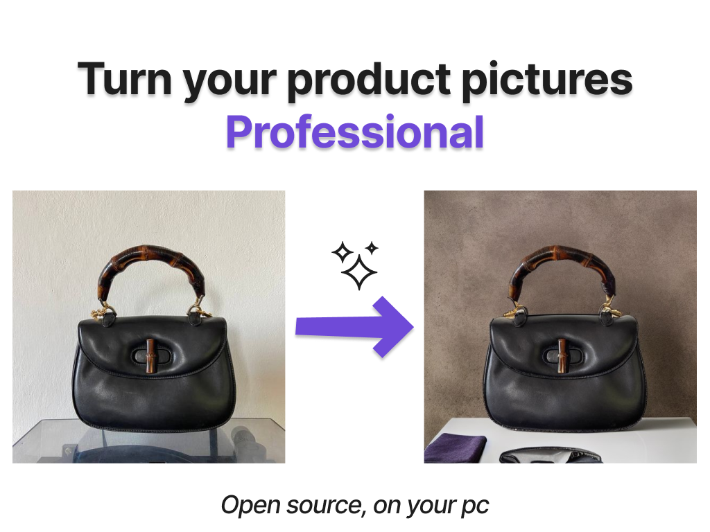

# AI Product Photographer

## How to set it up?
* Clone this repo
* Install the dependencies of the `requirements.txt` file
* Download the [Segment Anything Model](https://github.com/facebookresearch/segment-anything)

## How to use it?
* Run with `streamlit run main.py` (it takes some time at the first run to download the Stable Diffusion images from Hugging Face)
* Upload your product picture

* Click on the product for helping the segmentation and generate the mask

* Once the mask has been generated, write a prompt for the AI to generate the inpainting

* Obtain the final result (and iterate with the prompt if needed)

